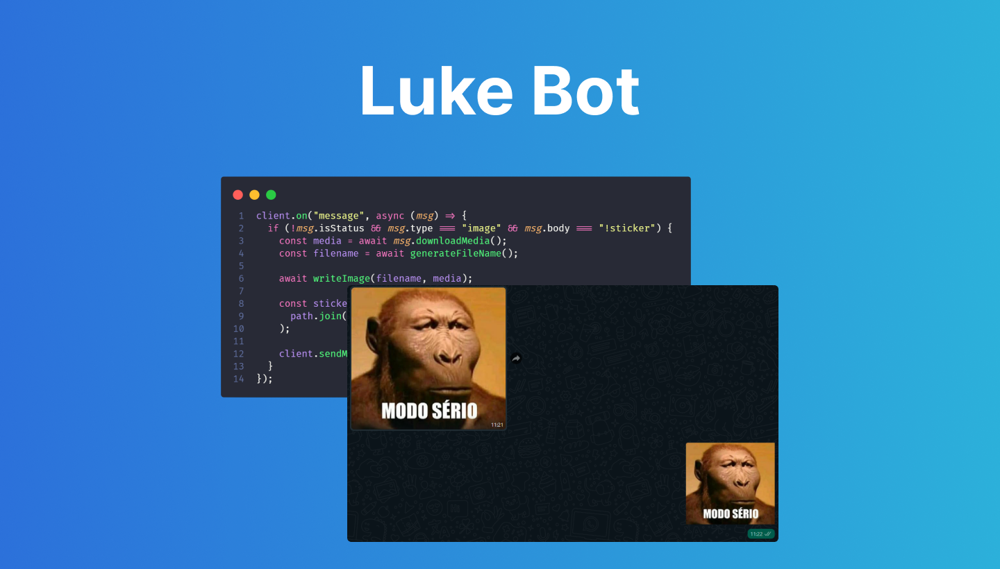

    

### 🤖 Luke Bot v1.0

Luke Bot is a WhatsApp Bot that generates stickets from images sent by user.

### How to run

- Clone the repository
- Open `app.js` and uncomment `qr` event
- Run `npm install` to install all needed dependencies
- Run `npm start` to start the app
- Scan the QR Code on terminal to connect

Luke Bot is now ready to generate stickers

_To generate a sticker, Luke Bot needs to receive an image with a "!sticker" command as legend._

### Developed with

- JavaScript
- Node.js
- [Whatsapp-web.js](https://github.com/pedroslopez/whatsapp-web.js)

### Reminder

On next versions, Luke Bot will receive videos, gifs, and be available on cloud.

---

Developed with 💙 by [Lucas Rangel](https://www.linkedin.com/in/lucasrngl)
